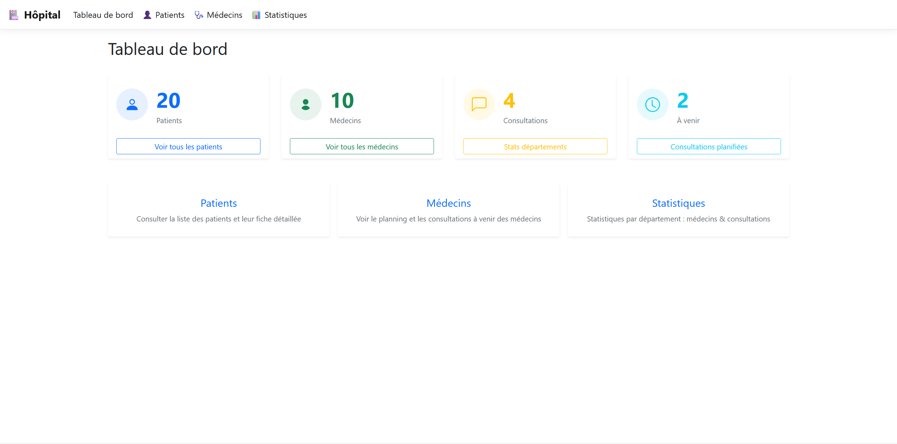

# 🏥 TP Gestion Hôpital — Entity Framework Core

Application web ASP.NET Core MVC de gestion hospitalière



## Stack technique

| Technologie | Version |
|---|---|
| .NET / ASP.NET Core MVC | 8.0 |
| Entity Framework Core | 8.0.24 |
| Base de données | SQLite |
| Frontend | Bootstrap 5 |

---
## Informations

Réponses aux questions des différentes étapes dans le fichier Reponses.md

---

## Installer dotnet ef

```bash
dotnet tool install --global dotnet-ef
```

---

## Installation

```bash
# 1. Cloner le dépôt
git clone https://github.com/MathieuGDev/TP-Gestion-Hopital.git
cd TP-Gestion-Hopital/tp_hospital

# 2. Restaurer les dépendances
dotnet restore

# 3. Appliquer les migrations et créer la base de données SQLite
dotnet ef database update

---
## Lancement
dotnet run
```

---

## Structure du projet

```
tp_hospital/
├── Controllers/
│   ├── DashboardController.cs   
│   ├── PatientController.cs     # API REST patients
│   └── ConsultationController.cs# API REST consultations
├── Models/
│   ├── Patient.cs
│   ├── Doctor.cs
│   ├── Department.cs
│   ├── Consultation.cs
│   ├── Address.cs               # Owned Entity
│   ├── MedicalStaff.cs          # Classe de base TPH (Table Per Hierarchy)
│   ├── MedicalDoctor.cs
│   ├── Nurse.cs
│   └── AdministrativeStaff.cs
├── Data/
│   └── HospitalDbContext.cs     # DbContext + configuration + seeders
├── Migrations/                  # Migrations EF Core
├── Views/
│   └── Dashboard/               # Vues MVC du tableau de bord
└── appsettings.json             
```

---

## Fonctionnalités

### Tableau de bord (`/Dashboard`)
- Compteurs globaux : patients, médecins, consultations, planifiées
- Navigation vers tous les modules

### Patients (`/Dashboard/Patients`)
- Liste de tous les patients
- Clic sur une ligne → fiche complète avec toutes les consultations et les médecins associés

### Médecins (`/Dashboard/Doctors`)
- Liste de tous les médecins avec leur département

### Consultations planifiées (`/Dashboard/UpcomingConsultations`)
- Tableau de toutes les consultations avec statut `Scheduled` à partir d'aujourd'hui
- Liens croisés vers les fiches patients et plannings médecins

### Statistiques départements (`/Dashboard/DepartmentStats`)
- Nombre de médecins et de consultations par département

---

## API REST

| Méthode | Route | Description |
|---|---|---|
| `GET` | `/api/patient` | Liste paginée des patients |
| `GET` | `/api/patient/{id}` | Fiche patient + consultations |
| `GET` | `/api/patient/search?name=...` | Recherche par nom |
| `POST` | `/api/patient` | Créer un patient |
| `PUT` | `/api/patient/{id}` | Modifier un patient |
| `DELETE` | `/api/patient/{id}` | Supprimer un patient |
| `GET` | `/api/doctor` | Liste paginée des médecins |
| `GET` | `/api/doctor/{id}` | Fiche médecin + consultations |
| `GET` | `/api/doctor/search?name=...` | Recherche par nom ou spécialité |
| `POST` | `/api/doctor` | Créer un médecin |
| `PUT` | `/api/doctor/{id}` | Modifier un médecin |
| `DELETE` | `/api/doctor/{id}` | Supprimer un médecin |
| `POST` | `/api/consultation` | Planifier une consultation |
| `PUT` | `/api/consultation/{id}/status` | Modifier le statut |
| `DELETE` | `/api/consultation/{id}` | Annuler une consultation |
| `GET` | `/api/consultation/patient/{id}/upcoming` | Prochaines consultations d'un patient |
| `GET` | `/api/consultation/doctor/{id}/today` | Consultations du jour d'un médecin |

---

## Gestion des migrations

```bash
# Créer une nouvelle migration
dotnet ef migrations add NomDeLaMigration

# Appliquer les migrations en attente
dotnet ef database update

# Voir l'état des migrations
dotnet ef migrations list

# Revenir à une migration précédente
dotnet ef database update NomDeLaMigrationCible
```

---

## Modélisation avancée

### Types complexes — Owned Entity
`Address` est partagée entre `Patient` et `Department` sans table séparée :
```csharp
modelBuilder.Entity<Patient>().OwnsOne(p => p.Address); // colonnes dans Patients
modelBuilder.Entity<Department>().OwnsOne(d => d.ContactAddress); // colonnes dans Departments
```

### Héritage — Table Per Hierarchy (TPH)
Tout le personnel dans une seule table `MedicalStaff` avec une colonne `StaffType` :
```
MedicalStaff → MedicalDoctor | Nurse | AdministrativeStaff
```

### Hiérarchie de départements (auto-référence)
```csharp
// Exemple : Cardiologie → Cardiologie adulte + Cardiologie pédiatrique
public int? ParentDepartmentId { get; set; }
public Department? ParentDepartment { get; set; }
public ICollection<Department> SubDepartments { get; set; }
```
